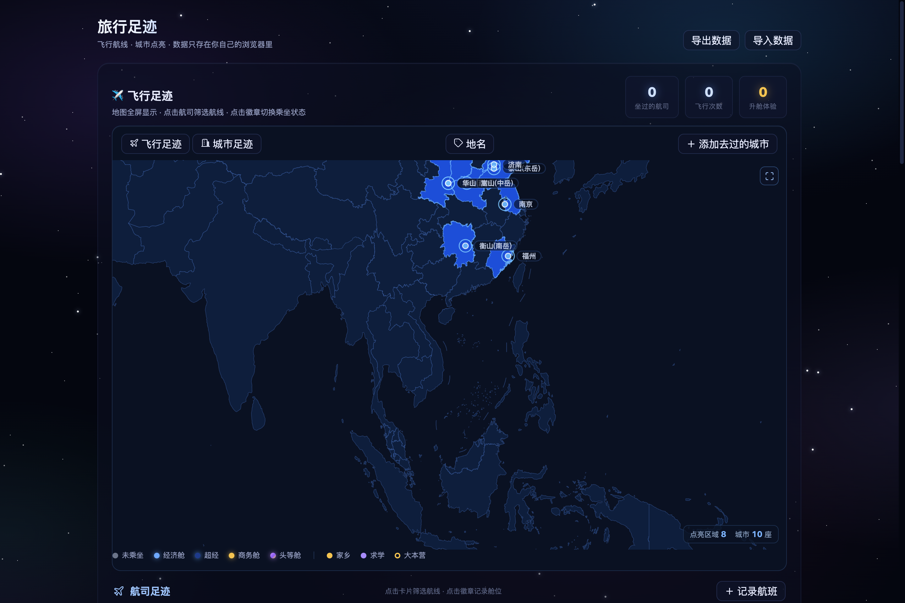

# 🌏 旅行足迹 · Travel Footprint

> 点亮去过的城市，记录每一段飞行。纯静态页面，数据只存在你自己的浏览器里。

**在线使用 → <https://clarencexmum.github.io/travel-footprint/>**



## 这是什么

一个可以直接打开就用的旅行地图。左侧是地图（中国省界 / 世界底图），右侧是飞行报告、航司卡片、最近航班。没有账号、没有后端、没有埋点——所有记录都保存在浏览器 `localStorage`。

- **两种模式**：飞行足迹（航线弧线 + 年份筛选）/ 城市足迹（点亮去过的城市）
- **记录航班**：航司、日期、航线、航班号、机型、舱位，点一次就存
- **手动点亮城市**：机场城市与主要城市内置坐标，输入城市名即可点亮
- **导入 / 导出**：一键导出 JSON 备份，换设备或换浏览器时导入还原
- **数据不出本机**：页面是纯静态文件，没有任何服务端请求

## 快速开始

**方式一：直接用线上版**

打开 <https://clarencexmum.github.io/travel-footprint/>，开始记录。

**方式二：本地跑一份**

```bash
git clone https://github.com/ClarenceXMUM/travel-footprint.git
cd travel-footprint
python3 -m http.server 8000
# 打开 http://127.0.0.1:8000
```

不需要 npm、不需要构建、不需要安装依赖——`index.html` 就是全部入口。

## 改成你自己的地图

预置的城市数据在 `assets/trip-data.json`：

```json
{
  "cities": [
    {
      "title": "五岳徒步，中国",
      "name": "五岳徒步，中国",
      "coord": [34.4833, 110.0833],
      "status": "已完成",
      "dates": ["2025-06-16", "2025-06-23"],
      "country": "中国"
    }
  ]
}
```

- `coord` 是 `[纬度, 经度]`，`status` 为 `已完成` 才会点亮
- 航班记录和手动点亮的城市在页面里直接添加，存在浏览器本地，用「导出数据」备份

想换成自己的足迹：改这个 JSON，或者直接在页面里手动记录。

## 数据与隐私

| 项目 | 说明 |
|------|------|
| 存储位置 | 浏览器 `localStorage`（key 前缀 `hermes.life.`） |
| 上传 | 无。页面不含任何上报、分析或第三方脚本 |
| 换设备 | 「导出数据」下载 JSON → 新设备「导入数据」 |
| 清空 | 浏览器清除站点数据即可 |

## 技术栈

- 原生 HTML / CSS / JavaScript，无框架、无构建
- [ECharts](https://echarts.apache.org/)（SVG 渲染）绘制地图与航线
- GeoJSON 底图：中国省界、世界地图、亚太区域
- 部署：GitHub Pages（`main` 分支根目录）

## License

[MIT](LICENSE) © 2026 Clarence Chen
